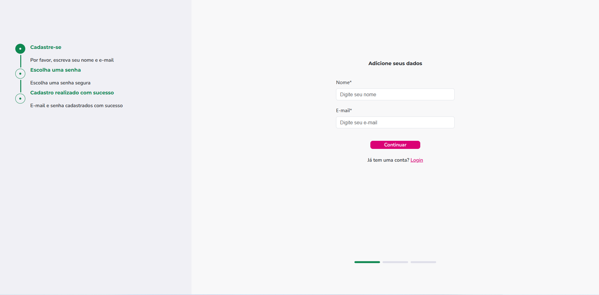
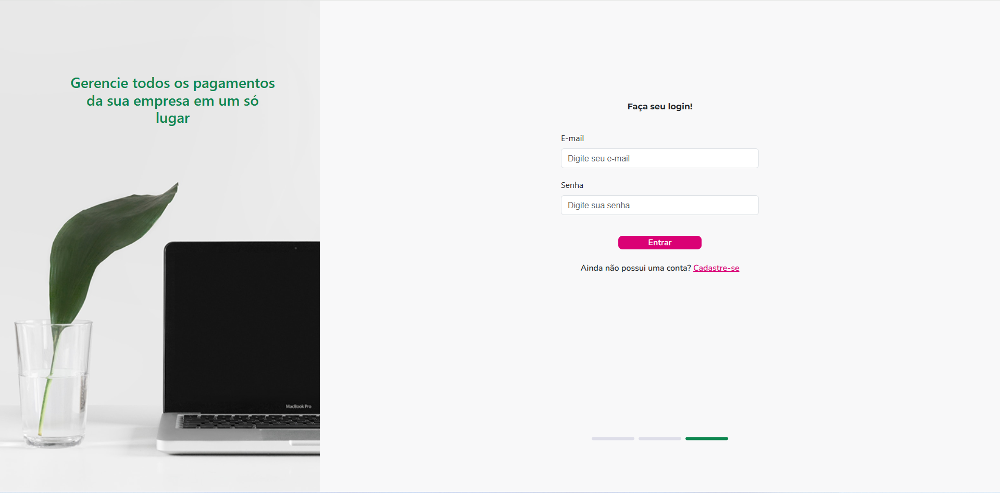
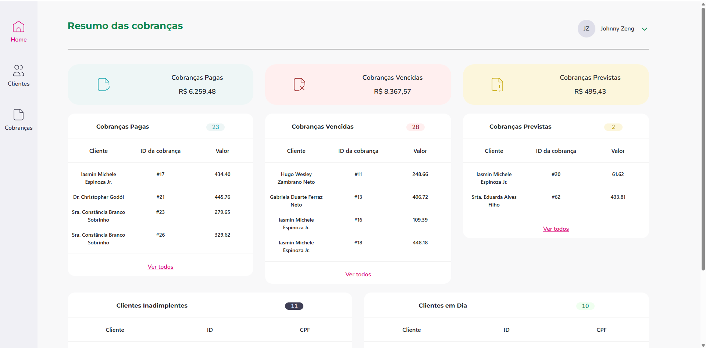
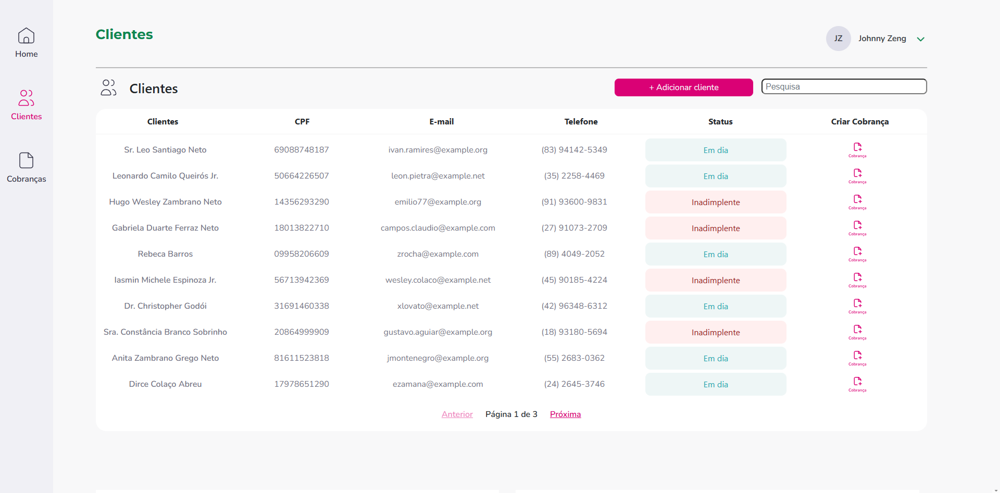
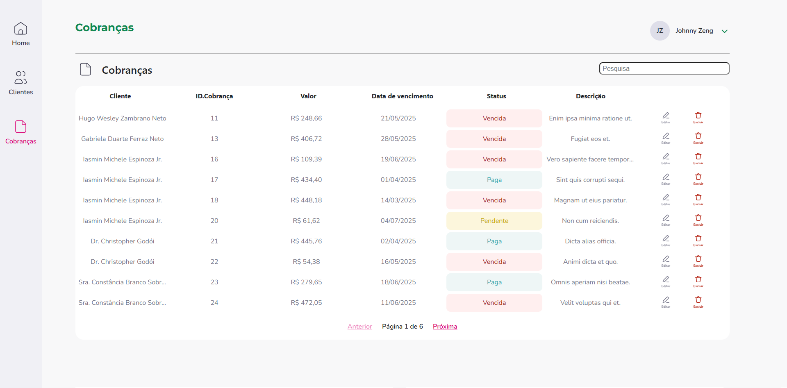

    

**Meu Projeto Pessoal: Cubos - React**

Este repositório contém um projeto pessoal desenvolvido com Node.JS (React) no back-end e JavaScript no front-end. O objetivo deste projeto foi criar um sistema de CRM (Customer Relationship Management) para treinar operações CRUD (Create, Read, Update, Delete) em entidades como Clientes, Cobranças e Usuários.

Tecnologias Utilizadas:

Back-end: Node.JS (React)

Eloquent ORM para interação com o banco de dados.

Sistema de roteamento e controladores.

Autenticação e autorização (se aplicável).

APIs RESTful para comunicação com o front-end (se aplicável).

Front-end: React

Ferramentas de Build: Vite

Estilização: Tailwind CSS

Requisições HTTP: Axios

Máscaras de Input: IMask e Inputmask

Manipulação do DOM para interatividade.

Requisições assíncronas (AJAX/Fetch API) para consumir as APIs do Node.JS.

Funcionalidades Principais:

Gerenciamento de Clientes: Criação, visualização, edição e exclusão de registros de clientes.

Gestão de Cobranças: Adição, consulta, atualização e remoção de informações de cobranças associadas aos clientes.

Administração de Usuários: Cadastro, listagem e gerenciamento de usuários do sistema.

Autenticação de usuários (registro e login).

Filtragem e busca de dados.

Interface responsiva para diferentes dispositivos.

### **Como Rodar o Projeto Localmente:**

1. **Clone o repositório:**  
   git clone git@github.com:JoZeng/projeto-cubos.git
   cd projeto-cubos
